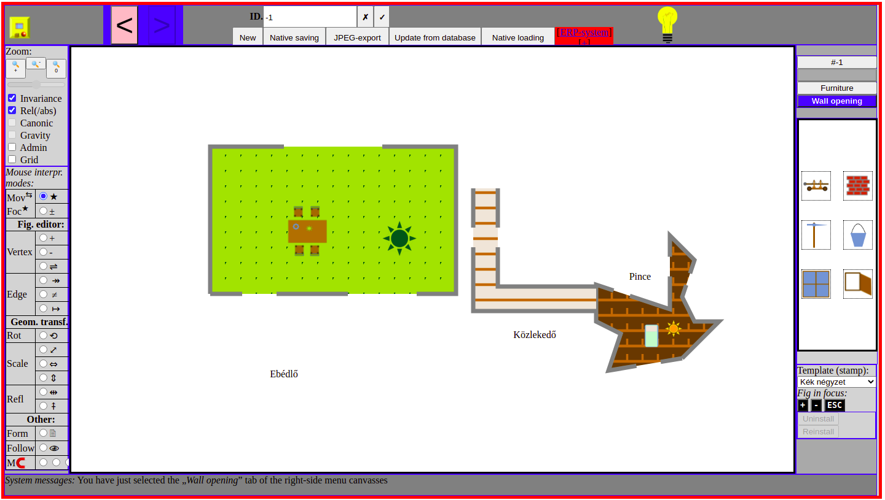
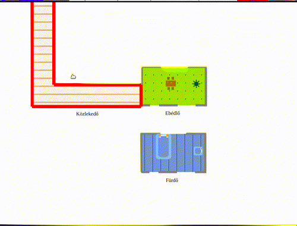
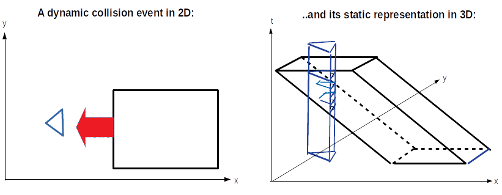
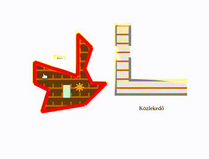

---
[[To project source]](#top) •|||• [[Back to central personal homepage]](https://alignalghii.github.io)

---

# Floor plan designer

## Project goal

Make a simple EPR system for a real estate agency. Actors: an admin, several employees (real estate agents) each managing his/her own customers and their flats. The employee can manage his/her customer's data in the common database.

But the EPR part is the simpler part of the task.

The second part of the task is to help the work of the employees by providing a nice graphics editor to them for drawing the floor plans easily and storing these along with the other data of the flats:

The editor must be custom software specifically designed for the specific features a floor plan can make:

- movable pieces of furniture: a piace of furniture can be re-arranged in a room, or a piece can be moved from one room into another
- movable doors and windows
- a hole must be hit into the wall automatically when a window or door is dragged to it
- doors, windows, pieces of furniture must „attach” to the room and move together with it after being attached
- doors can have a „direction” (opening inward vs outward) and a „handedness” (left-hand-opening vs right-hand-opening): this property must be easily changeble with mouse
- collision detection must be both realistic and practical:
    - a room's collision toward another room must be detected correctly, to ease putting two rooms side-by-side each other
    - pices of furniture also detect collision into each other or to the wall of a room: so the arrangement of them along a line or putting them along a wall or in a corner is easier
- a room's shape must be able to get re-shaped freely: walls moved, made wider open, new corners etc.
- There must be geometrical transformations, mirrorings, rescalings of most  objects

Of course, besides floor-plan-specific or real-estate-specific features, also common vector algebra graphics features must be implemented, like

- scale of the whole drawing, just like on geographical maps, providing the unit of measure, the zoom, the undo/redo-history etc.

## Collision detection

The heart of this floor plan designer graphics editor is the *collision detection*. Collision detection manifeests itself in the „jumpover” effect:

and in the „natural sliding” effect (shown later).

Implementation details about collision detection:

### Most basic ideas:

- A convex polygon is the intersection of its halfplanes: the halfplanes along its edges, each halfplain spreading towards the interior of the polygon.We say: the polygon is the interection of its *supporting halfplanes*.
- A halfplane can be determined by a linear inequality, similarly like a line is determined by a linear equation.
- Thus, a convex polygon is determined by a system of linear inequalities: the polygon regarded as a pointset is the solution set of its corresponding system of linear inequalities.
- To decide whether a given point belongs to a convex polygons: just check the system of linear inequalities with the coordinates of the point substituted into the *x* and *y* variables.
- To decide whether two given convex polygonals intersect: just unite their corresponding systems of linear equations into a common system. if this united system of linear inequalities is solvable, then the two convexp polygons intersect. If the united system has no solutions, then the two convex polygons are disjoint.
- For solving a system of linear inequalities, use the [Fourier-Motzkin elimination](https://en.wikipedia.org/wiki/Fourier%E2%80%93Motzkin_elimination).

Is this enough? No. A polygon can be also non-convex:

- A non-convex polygon can be regarded as the union of convex polygons.

### Anticipation of falling

That seems to be enough for collision detection. But no. Computers do not know real numbers in their infinitezimal continuity, computers are know only discrete things. whenever we are dragging a figure with the mouse, it is not moving in continuously, instead, it makes small but finite-sized jumps. When we are bumping, colliding a figure against another one, most probably we will not be so lucky to have that jump that exactly touches the target figure. we will simply have a pre-jump position with the two figures standing apart by a certain distance, and a post-jump position with the two figures intersecting and having a certain intrusion into each other. Thus, in a practical collision detection, the computer has to interpolate and compute the exact „time point” when a figure „falling” onto another figure „reaches”, „hits”, „touches” the target figure. It must do a „anticipation of falling” along a given „direction of falling”.

There is a geometrically very intuitive way to do that! Let us step out from the plane into the space: let us take an axis perpendicular to our working plane, and let this be a „*time axis*”. Now, a falling polygon can be modeled as an *oblique prism* whose base is the given polygon, and whose inclination angle can model the speed. Of course a „standing” polygon gets modelled as a *right prism*. We do not need the magnitude of speed now, but the inclination also provides the direction of the fall. Thus, the complete process of a collision event can be modelled completely by a static 3D world: a moving polygon colliding into a standing polygon is simply an oblique prism  and a right prism, whose bases may be distinct, but whose „towers” bump inti each other, i.e. their respective cross-sections of their lateral surfaces get intersected a certain height:

This model is static and expressive and intuitive, but the real good news is that it is also easy to calculate with it. The problem is modelled as intersection of (possible oblique) prisms. And fortunately a prism is nothing more than a polygon itself: a polygon in 3D space. Fourier-Motzkin elimination can be done in spaces in any number of dimension: a system of inequalities with the number of the variables corresponding to the dimension of the space.

In summary:

* to do collision detection in the narrow sense, simply do the Fourier-Motzkin elimination for 2D polygons. To do the anticipation of falling, parametrize Your inequality systems with a time parameter, and do the Fourier-Motzkin elimination in 3D.

### The natural sliding effect

With all these principles. You can make a complete collision detection application. The only facility still missing is: sliding. You cannot model yet the natural sliding effect of an object pressed slantly towards another object. So I made this effect by mixed heuristical means. I would prefer a more united solution, still, it works well:

## Architecture, design patterns, current state of development

Fourier-Motzkin elimination, and all the other supplementary features described above were written in Haskell by me, then I translated them into JavaScript. Algebraic datatypes (`Maybe`, `Either`) were also used in th Haskell way and implemented in JavaScript, using the idea of **case objects** of Scala (and Smalltalk), and the familiar *prototypal inheritance* technique.

Despite of these components made clear, the other business logic components of the program got stuck in bad design: now the project is somewhat stuck. In future, I plan to rewrite these parts using a declarative functional programming technique, probably monad transformers and some models from the design patterns of some of the effect-modelling Haskell  libraries.

### Used languages (currently)

- Backend: the little EPR has been written in PHP
- The editor itself is entirely done by client-side JavaScript
- Haskell is used as a documentation/analysing/checking tool only, but many parts of the JavaScript are almost direct translation from originally implemented and tested in Haskell.
    - The client-side has a cc. 20% of Haskell features
    - The PHP backend also has some Haskell-influenced designs
- Agda is a future plan only: to represent the collision detection „engine” in it, especially the Fourier-Motzkin elimination, and also some supplentary features. There are yet some consstency problems with modelling degenerated polygons.
